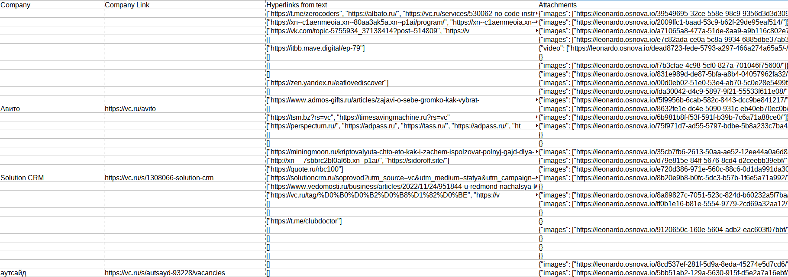
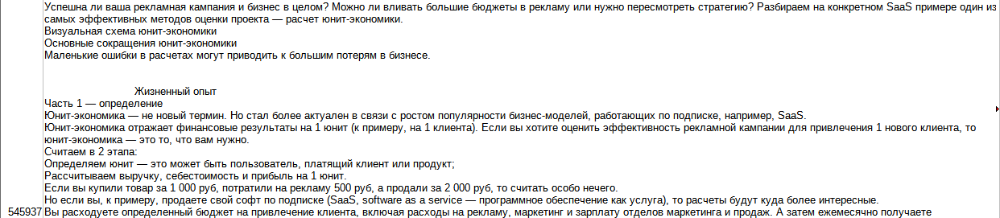

# Парсер статьей с сайтов vc.ru и dtf.ru
**Парсер создан исходя из идеи дальнейшей работы над несколькими задачами:**
1. Сбор массивов текстов для дальнейшего анализа и обработки текстов на естественном языке (NLP);
2. Сентиментальный анализ и анализ информационного фона вокруг личностей и брендов (SERM).

### Описание программы
По умолчанию, скрипт находит максимальное ID статьи на главной странице и собирает 100 статей от большего к меньшему.
Собираемые данные:
- ID
- URL
- Дата публикации
- Время публикации
- Заголовок статьи
- Автор статьи
- Ссылка на автора статьи
- Подсайт
- Ссылка на подсайт
- Компания
- Ссылка на компанию
- Текст
- Гиперссылки из текста
- Ссылки на вложения из статьи
- Количество комментариев
- Рейтинг
- Количество добавлений в избранное

Вывод данных осуществляется в .csv файл без текстов. Вывод текстов можно добавить аргументом командной строки.

Так же, есть возможность выводить данные в json, записывать собранные и обработанные тексты в отдельный .csv, задавать количество собираемых статей, начальное ID для сбора и задержку между обращениями к серверу.


Разработка и тестирование осуществлялись на **Python 3.10**. 


На Python 3.11 скрипт НЕ ЗАПУСТИТСЯ

### Примеры данных
- CSV




- JSON


- CSV (Texts)


### Запись в базу данных
При запуске парсера в директории с инициализирующим файлом parser.py будет создана база данных под управлением СУБД SQLite. Для каждого из источников будет создана отдельная таблица.

В нее будут записываться все собираемые данные, включая служебную информацию (несуществующие статьи, сгенерированная ссылка, код ответа сервера и т.д.).

**ВАЖНО!** Количество записей в базе данных и .csv/.json будут отличаться, так как в .csv записываются только существующие статьи, а в базу все существующие на площадке ID статей.

При запуске будет осуществлен сбор ID всех ранее собранных статей. В случае, если они уже есть в БД, повторно записываться они уже не будут

____

### Requirements
*Перечень всех зависимостей в requirements.txt*

```requirements.txt
requests==2.28.1
beautifulsoup4==4.11.1
lxml==4.9.1
```

### Запуск и аргументы командной строки
Запуск осуществляется из командной строки, из файла
`src/vc_parser/parser.py`

Обязательным аргументом необходимо передать площадку, с которой будут собираться данные: **vc** или **dtf**

`python src/vc_parser/parser.py vc`

`python src/vc_parser/parser.py dtf`
```bash
usage: src/vc_parser/parser.py [-h] {vc,dtf} [-h] [-a ARTICLES] [-aid ARTICLE_ID] [-d DELAY]
                               [-csv OUTPUT_CSV] [-json OUTPUT_JSON] [-texts OUTPUT_TEXTS]
      
options:
  -h, --help            show this help message and exit
  -a, --articles ARTICLES
                        (int) Set number of articles to collect. Default value: 100
  -aid, --article_id ARTICLE_ID
                        (int) Set ID from which the collection will start or a specific article
  -d, --delay DELAY
                        (float) Set the delay in seconds between requests to the server. 
                        Default value: 0.5
  -csv, --output_csv OUTPUT_CSV
                        (bool) Generate .csv file with result. Default value: True
  -json, --output_json OUTPUT_JSON
                        (bool) Generate .json file with result. Default value: False
  -texts, --output_texts OUTPUT_TEXTS
                        (bool) Generate .csv file with TEXTS. Default value: False
```

### Логика работы
- Получение html-кода главной страницы;
- Поиск массива выданных статей и получение максимального ID;
- Создание и проверка наличия базы данных;
- Создание .csv файла для дальнейшей записи данных;
- (опционально) Создание .json файла для дальнейшей записи данных;
- Последовательный парсинг страниц от полученного ID (или заданного аргументом -aid) в порядке убывания;
  - Преобразование страницы в объект BeautifulSoup;
  - Поиск по html-тегам или json-массивам всех компонентов данных статьи;
  - Валидация типов автор/подсайт/компания (в верстке находятся в одних и тех-же блоках, в разных комбинациях);
  - Разбор на блоки, валидация и очистка грязного текстового блока в чистый, разбитый переносами строк, текст;
- Запись всех собранных данных в словарь;
- Цикличная запись данных с каждой собранной страницы в созданный .csv файл и запись данных в соответствующую площадке таблицу БД;
- (опционально) Цикличная запись данных с каждой собранной страницы в созданный .json файл;
- (опционально) Завершение записи данных .json файл (как часть создания валидного json);

**Колонки .csv**:

| Параметр                | Тип      | Описание                          |
| :-- | :-- | :-- |
| `ID`                    | `int`    | Идентификатор статьи              |
| `URL`                   | `str`    | Ссылка на статью                  |
| `Date`                  | `str`    | Дата публикации                   |
| `Time`                  | `str`    | Время публикации                  |
| `Title`                 | `str`    | Заголовок статьи                  |
| `Author`                | `str`    | Автор статьи                      |
| `Profile Link`          | `str`    | Ссылка на подсайт                 |
| `Subsite`               | `str`    | Подсайт                           |
| `Subsite Link`          | `str`    | Ссылка на подсайт                 |
| `Company`               | `str`    | Компания                          |
| `Company Link`          | `str`    | Ссылка на компанию                |
| `Text`                  | `str`    | Текст                             |
| `Hyperlinks from text`  | `list`   | Гиперссылки из текста             |
| `Attachments`           | `json`   | Ссылки на вложения из статьи      |
| `Comments count`        | `int`    | Количество комментариев           |
| `Rating`                | `int`    | Рейтинг                           |
| `Favorites`             | `int`    | Количество добавлений в избранное |
